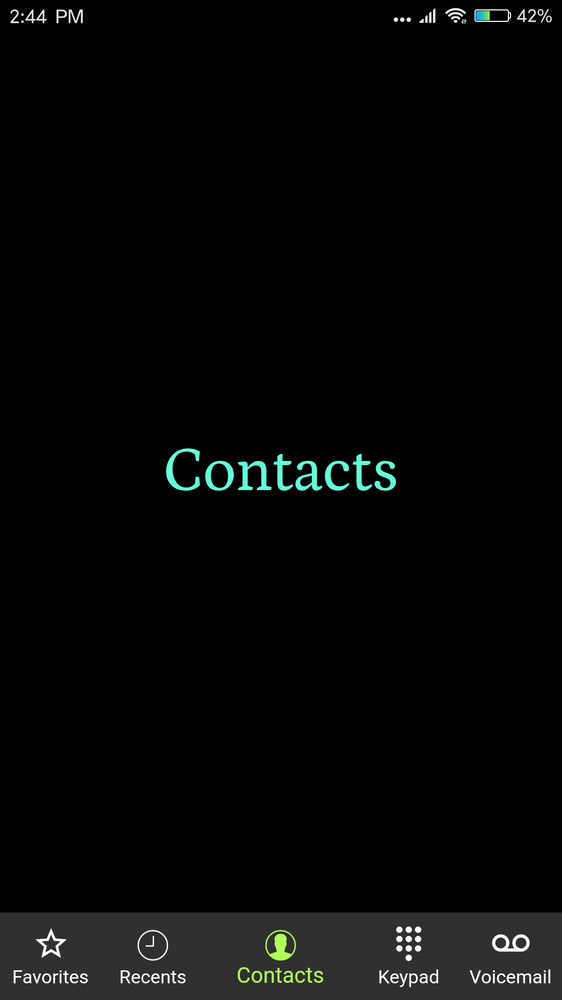
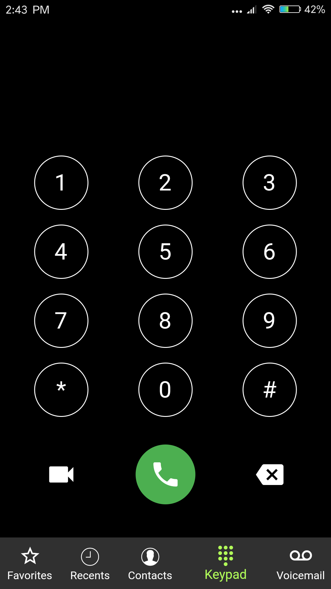

# Keypad
    

### :heart: Found this project useful?

If you found this project useful, then please consider giving it a :star: on Github and sharing it with your friends via social media.

## Project Created & Maintained By

### Chinky Sight

Specializing in cross-platform development with Flutter and Dart🎯 along with automation using python3.

 

<a href="https://www.facebook.com/chinkysight19">

